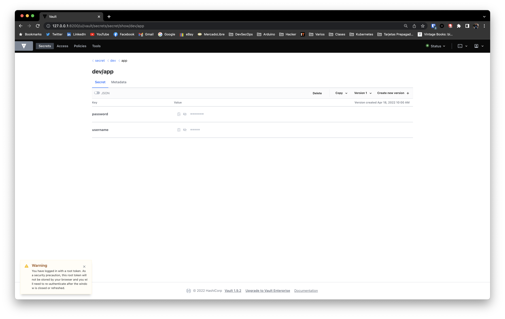
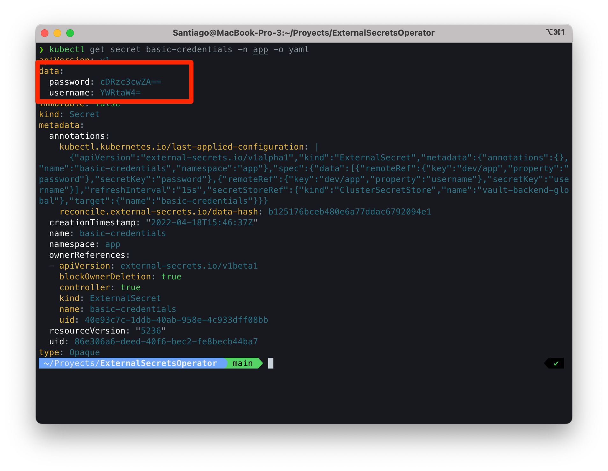

# External Secrets Operator & Hashicorp Vault

External Secrets Operator on Kubernetes with Hashicorp Vault

### Install Vault with Helm

``` bash
helm repo add hashicorp https://helm.releases.hashicorp.com
helm install vault hashicorp/vault --namespace vault --create-namespace -f hashicorp-vault/values.yaml
```

Port Forwarding to connect to ClusterIP

``` bash
kubectl port-forward vault-0 8200:8200 -n vault
```

Login with the client and put the key value secrets

``` bash
export VAULT_TOKEN="root"
export VAULT_ADDR='http://127.0.0.1:8200'

vault login -address=http://127.0.0.1:8200 -tls-skip-verify

vault kv put secret/dev/app username="admin" password="p4ssw0d"
```
<p align="center">

</p>

### Install External Secrets Operator with Helm

``` bash
helm repo add external-secrets https://charts.external-secrets.io

helm install external-secrets \
   external-secrets/external-secrets \
    --namespace external-secrets \
    --create-namespace \
    --set installCRDs=true
```

Deploy the ***secret.yaml*** with the token to connect to Vault and the ***clustersecretstore.yaml*** to point the Vault Server.

``` bash
kubectl apply -f external-secret
```

### Install External Secret on the Namespace

Create a ns to your app and deploy the secrets.

``` bash
kubectl create ns app
kubectl apply -f app/externalsecret-basic.yaml
```

Take a look to the secret in action! If you review the ***extanarsecret-basic.yaml*** you can check the refesh interval it's on 15 minutes.

<p align="center">

</p>